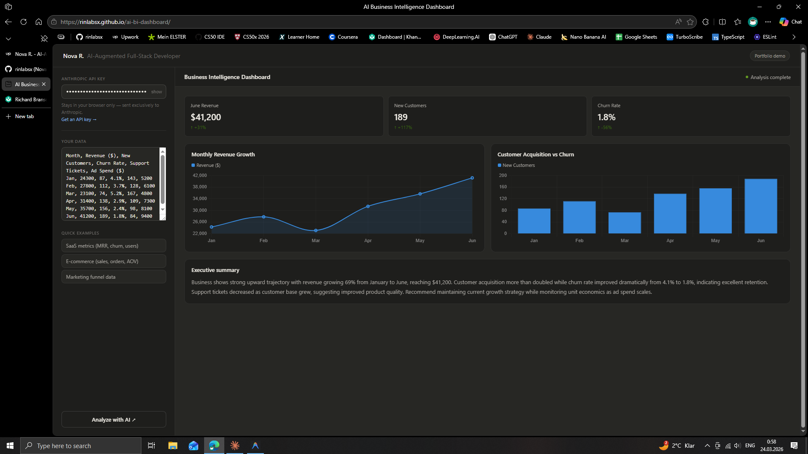

# AI Business Intelligence Dashboard

A lightweight, zero-dependency business intelligence dashboard powered by the Claude API. Paste any raw business data — sales figures, monthly metrics, KPIs — and get instant charts, KPI cards, and an AI-written executive summary.

**Live demo → [rinlabsx.github.io/ai-bi-dashboard](https://rinlabsx.github.io/ai-bi-dashboard)**

---

## What it does

- Accepts any tabular business data (CSV-style, freeform, or structured)
- Extracts the 3 most important KPIs automatically
- Generates 2 contextual charts (bar, line, or doughnut) using real data
- Writes a 3–4 sentence executive summary with trends and recommendations
- Works entirely in the browser — no backend, no server, no build step

## Tech stack

- Vanilla HTML, CSS, JavaScript (single file, no framework)
- [Chart.js](https://www.chartjs.org/) for data visualization
- [Anthropic Claude API](https://www.anthropic.com/) (`claude-sonnet-4-20250514`) for analysis

## Running it locally

No installation needed. Just open `index.html` in any modern browser.

You'll need an Anthropic API key — grab one free at [console.anthropic.com](https://console.anthropic.com/settings/keys). Your key stays in the browser and is sent exclusively to Anthropic's API.

## Why this exists

This is a portfolio piece demonstrating AI-augmented full-stack development — specifically how Claude can be integrated as an analytical layer on top of a clean frontend to deliver real business value with minimal code.

Built by [Nova R.](https://www.upwork.com/freelancers/~0176f7c51b68d07c0e) — AI-Augmented Full-Stack Developer based in Germany.

---

## License

MIT
